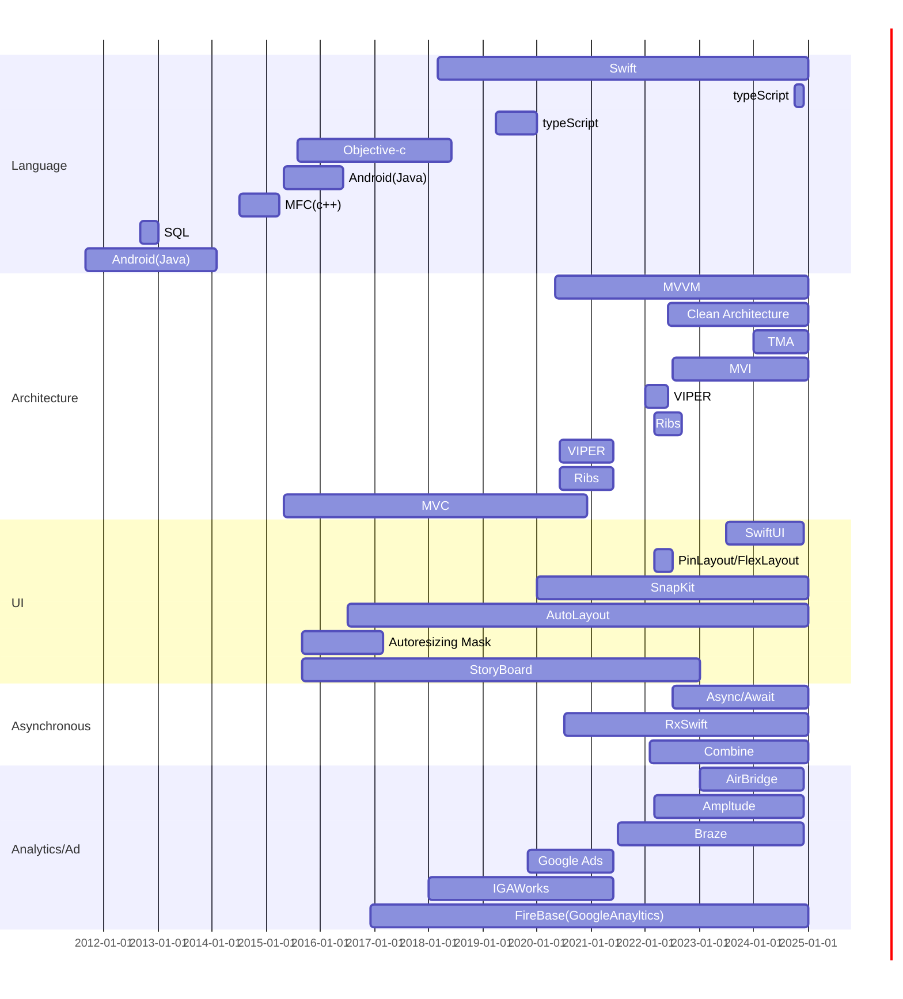

# 포트폴리오
## 기술 스택

## 경력 사항

## 비주얼 (21.07 ~ 24.12)

### 아몬즈 아키텍처 개선 Tuist 적용 및 TMA (24.04 ~ 24.12)

| **항목**              | **내용**                                           |
|----------------------|---------------------------------------------------|
| **역할**               | iOS 개발 및 리딩 (참여인원: iOS 3)                                     |
| **주요 기술**           | Tuist, Swinject                                   |
| **도전 과제 및 해결 방법** | Application / Feature / Domain / Core / Shared 계층 분리      |
| **성과/지표**           | 빌드속도 50% 감소, 개발속도 10% 증가,                  |
| **배운 점**             | 명확한 계층정의로 공통된 모듈 개발                             |

### App팀 배포열차 도입 (24.07 ~ 24.12)

| **항목**              | **내용**                                                       |
|----------------------|---------------------------------------------------------------|
| **역할**               | 스쿼드 리더 (참여 인원 : Android 1, iOS 1, PO 1, QA 1)                               |
| **주요 기술**           | Trunk Based Develpment, Feature Flag, Jira Automation, Slack   |
| **도전 과제 및 해결 방법** | 배포 관련 일정 논의 및 결정(매주 1회, 검수 프로세스 월~목, 심사 제출 금, 실 배포 화) |
| **성과/지표**           | 주마다 배포 횟수 21% 증가  / 슬랙 배포 관련 논의 15% 감소 |
| **배운 점**            | 유연한 CI/CD를 정해둬 어렵지 않게 적용.               |

### Swagger -> Swift 파일 전환 자동화 (23.05 ~ 23.06)
| **항목**              | **내용**                                                       |
|----------------------|---------------------------------------------------------------|
| **주요 기술**           | OpenAPISpec 3.0, RestfulAPI, Moya, Alamofire, yaml   |
| **도전 과제 및 해결 방법** | 배포 관련 일정 논의 및 결정(매주 1회, 검수 프로세스 월~목, 심사 제출 금, 실 배포 화) |
| **성과/지표**           | API관련 이슈 90% 감소, 디코딩 에러 파악율 100% 달성, 작업속도 10% 이상 증가, 관련 블로그 작성 |
| **배운 점**            | 사람은 실수를 할 수 있어도, 기계는 실수하지 않는다. 자동화된 테스트코드 생성이 안정성 증가에 큰 도움을 줌   |

### Clean Architecture 도입 및 개선(23.02 ~ 23.12)
| **항목**              | **내용**                                                       |
|----------------------|---------------------------------------------------------------|
| **역할**               | 팀 스터디 리딩 및 iOS 메인 개발 (참여 인원: Android 2, iOS 3, QA 1)          |
| **주요 기술**           | Clean Architecture, Present/Domain/Data Layer   |
| **도전 과제 및 해결 방법** | DTO의 view에서 사용하는 비율 축소, Domain의 분리, API 모듈 분리 |
| **성과/지표**           | 관련 블로그 작성, Android <-> iOS 통일성 향상(도메인 30% 로직 통일), 버그율 13% 감소 |
| **배운 점**            | 참여인원 모두 공부가 필요, 비개발자도 이해할 수 있는 설명 진행, 계층을 나누기 위해서도 그안에 명확한 정의 필요               |

### ReactorKit을 활용한 ViewModel 마이그레이션 (22.03 ~ 22.12)

| **항목**              | **내용**                                           |
|----------------------|---------------------------------------------------|
| **역할**               | 스터디 주최 및 iOS 개발                                           |
| **주요 기술**           | ReactorKit, MVVM, Action/State, RxSwift                                    |
| **도전 과제 및 해결 방법** | viewDelegate선언 및 viewModel에 viewDelegate 주입,                             |
| **성과/지표**           | 전체 화면 중 30% 적용, Crash율 0.5% 상승, 버그율 10% 상승                                             |
| **배운 점**             | 업무 파악 전 무리한 적용으로 안정성 하락, 명확한 아키텍처 통일 필요, 테스트 코드 필요성 확인, 팀원간 협업 및 내용 공유 부족함을 실감  |

### MVC -> MVVM 개선 (21.10 ~ 22.01)

| **항목**              | **내용**                                           |
|----------------------|---------------------------------------------------|
| **역할**               | iOS 개발                                           |
| **주요 기술**           | MVVM, input/output 패턴         |
| **도전 과제 및 해결 방법** | viewDelegate선언 및 viewModel에 viewDelegate 주입,                             |
| **성과/지표**           | 전체 화면 중 30% 적용, Crash율 0.5% 상승, 버그율 10% 상승                                             |
| **배운 점**             | 업무 파악 전 무리한 적용으로 안정성 하락, 명확한 아키텍처 통일 필요, 테스트 코드 필요성 확인, 팀원간 협업 및 내용 공유 부족함을 실감  |

## 하나모바일 (18.01 ~ 21.06)
### 다다
### 더티켓
### 흔들어대리운전
### 두줄운세
### 위피캠
### Pickmecam
### BizID

### 더스타 온라인 iOS/Web

### Enjoy J Tour

### 2018 KPMA

### 2018 서울가요대상

### 2018 더서울어워즈

### 스마트이미지

### 미스코리아(투표)

### FanPoint

## 새움테크 (15.05 ~ 18.01)
### 마이홈플러스포인트

### 와인그래프

### 나눔로또

### 우리캐피탈

### 현대라이프 상담사용

### CJ One Card

### 아주캐피탈 

### 99Pay

### thePay

### 엘리시안

<table>
  <tr>
    <td> 이미지 </td>
    <td>  </td>
    <td>  </td>
    <td>  </td>
    <td>  </td>
  </tr>
  <tr>
    <td>사용기술</td>
    <td colspan="4"> 내용 입력</td>
  </tr>
  <tr>
    <td>설명</td>
    <td colspan="4"> 내용 입력</td>
  </tr>
</table>

## 유니텍 (14.07 ~ 15.04)
### MFCC 

## 강원대학교 전산원 (11.07 ~ 13.02)
### 강원대학교 App
