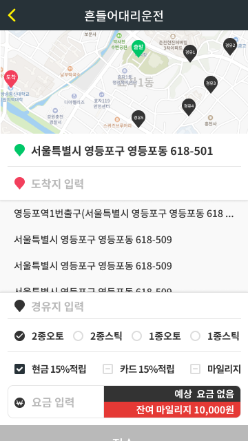
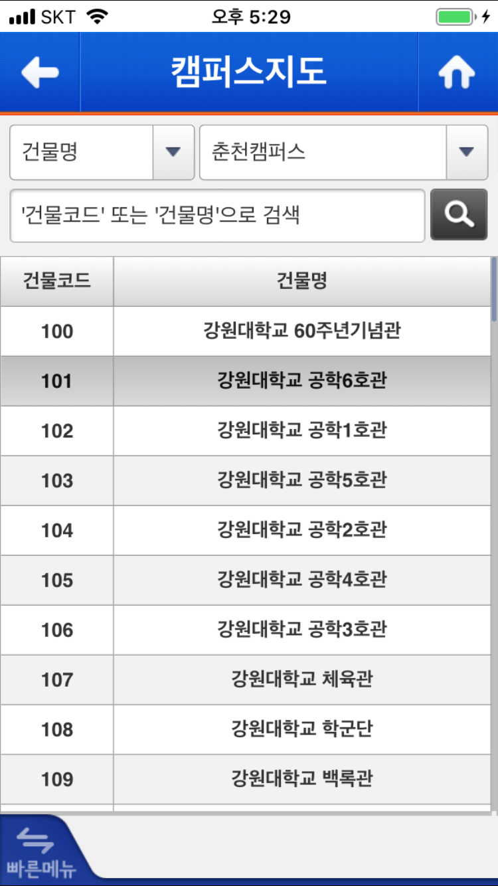

# 포트폴리오
# 기술 스택

  

# 경력 사항

  

# 비주얼 (21.07 ~ 24.12)

## 아몬즈 아키텍처 개선 Tuist 적용 및 TMA 구조 확립 (24.04 ~ 24.12)

<table style="width: 100%; border: 1px solid black; border-collapse: collapse;">
<tr>
<td style="width: 150px;"> 역할 </td>
<td>

- iOS 개발 및 리딩 (참여인원: iOS 3)
</td>
</tr>
<td> 주요 기술 </td>
<td>

- [Tuist](https://docs.tuist.dev/en/), [The Modular Architecture (TMA)](https://docs.tuist.dev/en/guides/develop/projects/tma-architecture), [Swinject](https://github.com/Swinject/Swinject)  

</td>
</tr>

<td> 도전 과제 및 해결 방법 </td>
<td>

- Application / Feature / Domain / Core / Shared 계층 분리
- 모듈별 구조 확립 및 테스트 코드 작성 유도
- 모듈생성시 스크립트를 통해 동일한 구조로 자동 생성

</td>
</tr>
<td> 성과/지표 </td>
<td>

- CI 빌드테스트 속도 50% 감소(12분 -> 5분)
- 개발속도 10% 증가(모듈별 빌드)
- 테스트 커버리지 13% 증가
- 머지 컨플릭 비율 감소(.xcodeproj/* ignore)
- [관련 블로그](https://medium.com/@talq44/github-action과-self-hosted-runner로-ios-build-test를-돌리는-거기에-tuist를-곁들인-ea4af8ace455)

</td>
</tr>
<td> 배운점/아쉬운점 </td>
<td>

- 명확한 계층정의로 협업 맴버 공통된 형태의 모듈 개발
- 모듈별 테스트가 추가되어 안정성 향상
- project 파일이 더이상 추가되지 않아 코드 형상 관리가 간편해짐
- 모듈별 interface로 더 명확한 캡슐화
- 클린아키텍처, cocoapods -> SPM으로 모두 변경, 모듈 레이어 등 선행이 필요한 업무가 늦어지며 너무 늦게 반영한데에 대한 아쉬움
- 마이그레이션 하며 기존 코드도 지우는 프로세스를 확립하지 못함
- 80% 이상 모듈로 대체하려 했으나 회사 사정으로 모두 완수하지 못한데에 대한 아쉬움
</td>
</tr>
</table>

## App팀 배포열차 도입 (24.07 ~ 24.12)

<table style="width: 100%; border: 1px solid black; border-collapse: collapse;">
<tr>
<td style="width: 150px;"> 역할 </td>
<td>

- 스쿼드 리더 (참여 인원 : Android 1, iOS 1, PO 1, QA 1)
</td>
</tr>
<td> 주요 기술 </td>
<td>

- [Trunk Based Develpment(TBD)](https://trunkbaseddevelopment.com/), Feature Flag, Jira Automation, Slack
</td>
</tr>
<td> 도전 과제 및 해결 방법 </td>
<td>

- 배포 관련 일정 논의 및 결정
  - 매주 1회
  - 검수 프로세스 월~목
  - 심사 제출 금
  - 실 배포 화요일
- 배포 자동화
  - FeatureFlag 상태가 개발중 -> 작업완료시 자동 내부 배포
  - PO / QA 슬랙을 통해 배포 앱 생성 기능 제공
  - 금요일 오전 최종 확인용 앱 자동 내부 배포
- 슬랙 리마인더
  - 작업 담장자 가이드 문구 자동 노출
  - PO / QA 내용 공유
  - 포함되는 기능(티켓 + 피쳐플래그) 내용 공유
- 지라 상태 자동화
  - 개발 완료시 상태 변경 자동화
  - 담당자 지정 자동화
  - (실) 배포 완료시 상태 변경 자동화 
</td>
</tr>
<td> 성과/지표 </td>
<td>

- 주당 배포 횟수 21% 증가
- 슬랙 배포 관련 논의 15% 감소
- 피쳐플래그를 통해 잘못된 배포 disable 처리 기능 제공
- [관련 블로그](https://medium.com/@talq44/작은-pr-feature-flag-trunk-based-developement-그리고-자동화로-매일-develop-매주-production-배포하는-팀-되기-1-c9b2b63f424a)
</td>
</tr>
<td> 배운점/아쉬운점 </td>
<td>

- 유연한 CI/CD를 토대로 빠른 적용
- 하나의 팀으로 정확한 내용공유
- Store 심사제출까지 자동화 하지 못한 아쉬움
</td>
</tr>
</table>

## Swagger -> Swift 파일 전환 자동화 (23.05 ~ 23.06)

<table style="width: 100%; border: 1px solid black; border-collapse: collapse;">
<tr>
<td style="width: 150px;"> 역할 </td>
<td>

- 메인 개발 (참여 인원 : iOS 1)
</td>
</tr>
<td> 주요 기술 </td>
<td>

- Swift, OpenAPISpec 3.0, RestfulAPI, Moya, Alamofire, yaml
</td>
</tr>
<td> 도전 과제 및 해결 방법 </td>
<td>

- OAS 3.0기준 Swagger 문서를 UserAPI모듈로 생성하기
  - SwaggerCodeGen은 단순 DTO만 생성해서 탈락
  - 직접 대체할수 있도록 Swift로 제작
- 네트워크 모듈 형식 결정 필요
  - TMA 외부 노출 인터페이스 생성
  - 내부 형태는 Moya 형식으로 사용하기로 결정
  - Rx 비율을 낮추기 위해 Asyn/Await으로 결정
- 팀원 동일한 형식 사용
  - 별도 앱으로 생성해 작업시 변경되면 담당자가 덮어씌우도록 결정
</td>
</tr>
<td> 성과/지표 </td>
<td>

- API관련 이슈 90% 감소
- 디코딩 에러 파악율 100% 달성
- 작업속도 10% 이상 증가
- API관련 논의 30% 감소
- [관련 블로그](https://medium.com/bejewel/swagger-converter-제작기-84e4726f2be2)
</td>
</tr>
<td> 배운점/아쉬운점 </td>
<td>

- 사람은 실수를 할 수 있어도, 기계는 실수하지 않는다. 
- 자동화된 테스트코드 생성이 안정성 증가에 큰 도움을 줌
- User API가 변경되면 Github에서 PR이 생성되서 대체하고 싶었으나 리소스 부족으로 포기
  - 당시 Feature Flag가 확립되지 않아, 서비스에 영향을 끼칠 우려가 있어 미룸
  - 파이썬으로 코드를 대체해 Github Action으로 만들 구상까지 하고 다른 업무로 포기
</td>
</tr>
</table>

## Clean Architecture 도입 및 개선(23.02 ~ 23.12)

<table style="width: 100%; border: 1px solid black; border-collapse: collapse;">
<tr>
<td style="width: 150px;"> 역할 </td>
<td>

- App 팀 리드 (참여 인원 : Android 2, iOS 3, PO 1, QA 1)
</td>
</tr>
<td> 주요 기술 </td>
<td>

- Clean Architecture, Snapshot Test
</td>
</tr>
<td> 도전 과제 및 해결 방법 </td>
<td>

- 클린아키텍처에 대한 전반적인 지식 부족
  - 스터디 진행 및 지속적 가이드 실시
- 전체 프로젝트에 대한 적용의 어려움
  - ViewModel 마이그레이션이 완료된 부분에 한해 적용 시작
  - ViewModel에서 Domain/Data 부분 분리를 우선적으로 시작
- 명확한 계층 분리에 대한 의견 대립
  - PO가 이야기하는건 Domain, Back-end가 이야기하는건 Data, UX가 이야기하는건 Presenter로 단순화해 내용 공유
  - 비지니스 로직에 대해, 크게 바뀌지 않으면서도 중요한 부분이란 인식을 학습시킴
- 마이그레이션이 부족한 화면의 경우 DTO에 너무 강하게 묶임
  - DTO와 ViewState의 분리에 대해 강조 후 서로 다름을 인지시키도록 학습
  - 스냅샷 테스트를 통해, ViewState로 대체해가면서도 안정성있게 작업할 수 있도록 테스트코드 우선

</td>
</tr>
<td> 성과/지표 </td>
<td>

- 버그율 5% 감소
- 작업속도 5% 증가
- Android, iOS 공통 도메인 로직 생성
- [관련 블로그](https://medium.com/bejewel/저희는-클린한-구조를-지향하고-있습니다-888a3dc1c03a)
</td>
</tr>
<td> 배운점 </td>
<td>

- Data에 휘둘리지 않는 작업이 가능해짐
- Backend-Client 동시 작업이 가능해짐
- 개발자간의 대화보다도 중요한 Domain의 중요성에 대해 팀적 공유
  - 추가) Domain Driven Design(DDD) 스터디 추가 진행
  - 추가) Design First 도입
</td>
</tr>
</table>

## ReactorKit을 활용한 ViewModel 마이그레이션 (22.03 ~ 22.12)

<table style="width: 100%; border: 1px solid black; border-collapse: collapse;">
<tr>
<td style="width: 150px;"> 역할 </td>
<td>

- iOS 파트 리드(참여 인원 : iOS 2)
</td>
</tr>
<td> 주요 기술 </td>
<td>

- ReactorKit, MVVM, RxSwift, Action/State
</td>
</tr>
<td> 도전 과제 및 해결 방법 </td>
<td>

- Input/Output 패턴보다 더 명확한 Action/State로 변경
- 

</td>
</tr>
<td> 성과/지표 </td>
<td>

- 전체 페이지의 60% ReactorKit으로 대체
- ReactorKit으로 대체한 화면의 Action당 테스트코드 0.7개 생성
- 테스트커버리지 15% 향상
- 버그 발생율 30% 감소
</td>
</tr>
<td> 배운점/아쉬운점 </td>
<td>

- Action -> State로 단방향 흐름이 되며, 복잡한 기능은 없음을 다시 한번 경험
- 페이지별 분리가 아닌, 컴퍼넌트별 모듈 분리로 진행했다면 더 빠른 모듈 분리가 진행되었겠으나, iOS만 진행되어 페이지 단위로 한정
  - 추후 모듈별 상세 분리를 진행하며 추가 분리 가능해짐
- Android, iOS, (mobile)Web 모두 비슷한 로직임에도 서로 대화없이 진행됨에 대한 아쉬움
  - Reactive Native, Flutter의 도입에 대해 논의 했으나 미뤄짐
- 

</td>
</tr>
</table>

## MVC -> MVVM 개선 (21.10 ~ 22.01)

<table style="width: 100%; border: 1px solid black; border-collapse: collapse;">
<tr>
<td style="width: 150px;"> 역할 </td>
<td>

- iOS 파트 리드(참여 인원 : iOS 2)
</td>
</tr>
<td> 주요 기술 </td>
<td>

- MVVM, [input/output 패턴](https://github.com/kickstarter/native-docs/blob/master/inputs-outputs.md)
</td>
</tr>
<td> 도전 과제 및 해결 방법 </td>
<td>

- MVC로 화면에 있는 
- Input/Output 패턴보다 더 명확한 Action/State로 변경

</td>
</tr>
<td> 성과/지표 </td>
<td>

- 3개의 페이지에 적용
  - 추후 ReactorKit으로 대체
- Crash율 0.5% 상승
- 버그율 10% 상승

</td>
</tr>
<td> 배운점/아쉬운점 </td>
<td>

- 업무 파악 전 무리한 적용으로 안정성 하락
- 테스트 코드 필요성 확인
- 팀원간 협업 및 내용 공유 부족함을 실감 이를 위한 명확한 아키텍처/패턴 통일 필요성 확인
</td>
</tr>
</table>

  

# 하나모바일 (18.01 ~ 21.06)
## 더티켓
<table style="width: 100%; border: 1px solid black; border-collapse: collapse;">
<tr>
    <td> 이미지 </td>
    <td> 
      

        
        
        
        
      

    </td>
  </tr>
</tr>
<tr>
<td style="width: 150px;"> 역할 </td>
<td>

- iOS 메인 개발자 (참여 인원 : iOS 1)
</td>
</tr>
<tr>
<td> 주요 기술 </td>
<td>

- Alamofire, Firebase, RxSwift, RxCocoa, RxGesture

</td>
</tr>
<td> 도전 과제 및 해결 방법 </td>
<td>

- 티켓 예약 내역 및 이벤트/관람 정보를 확인 가능
- 별도 상세 접수화면에서 추가 사항 기입 가능
- SNS를 통한 간편 로그인 기능 제공
- Rx를 활용한 MVVM구조 프로젝트 작성

</td>
</tr>
</table>

## [흔들어대리운전 (20.10 ~ 20.11)](https://apps.apple.com/kr/app/%ED%9D%94%EB%93%A4%EC%96%B4%EB%8C%80%EB%A6%AC%EC%9A%B4%EC%A0%84-13-%EC%A0%81%EB%A6%BD/id1245517555)
<table style="width: 100%; border: 1px solid black; border-collapse: collapse;">
<tr>
    <td> 이미지 </td>
    <td> 
      

        
        
        
        
      

    </td>
  </tr>
</tr>
<tr>
<td style="width: 150px;"> 역할 </td>
<td>

- iOS 메인 개발자 (참여 인원 : iOS 1)
</td>
</tr>
<tr>
<td> 주요 기술 </td>
<td>

- Alamofire, NMapsMap(네이버맵), Firebase
- RxSwift, RxCocoa, RxGesture

</td>
</tr>
<td> 도전 과제 및 해결 방법 </td>
<td>

- 위치좌표 및 모션 캡쳐를 활용한 대리운전 앱
- 네이버 맵을 이용한 현재 위치 표현
- 별도 상세 접수화면에서 추가 사항 기입 가능
- Rx를 활용한 MVVM구조의 프로젝트 작성
- 위치좌표의 정확성에 따른 알럿창 구분

</td>
</tr>
</table>

## 두줄운세
<table style="width: 100%; border: 1px solid black; border-collapse: collapse;">
<tr>
    <td> 이미지 </td>
    <td> 
      

        
        
      

    </td>
  </tr>
</tr>
<tr>
<td style="width: 150px;"> 역할 </td>
<td>

- iOS 메인 개발자 (참여 인원 : iOS 1)
</td>
</tr>
<tr>
<td> 주요 기술 </td>
<td>

- Alamofire, Socket.IO-Client-Swift, Firebase, Kingfiser
- RxSwift, RxCocoa, RxGesture

</td>
</tr>
<td> 도전 과제 및 해결 방법 </td>
<td>

- 운세 상담 및 전화상담 서비스 제공 App
- 메인 페이지 및 회원가입을 네이티브로 제작
- 그외 추가 상세페이지는 웹뷰로 이동

</td>
</tr>
</table>

## [Pickmecam](https://apps.apple.com/kr/app/%ED%94%BD%EB%AF%B8%EC%BA%A0-%EC%98%81%EC%83%81%EC%B1%84%ED%8C%85-%ED%99%94%EC%83%81%EC%B1%84%ED%8C%85/id1503303615) / [위픽캠](https://play.google.com/store/apps/details?id=com.live.camtalk&hl=ko)
<table style="width: 100%; border: 1px solid black; border-collapse: collapse;">
<tr>
    <td> 이미지 </td>
    <td> 
      

        
        
        
        
      

    </td>
  </tr>
</tr>
<tr>
<td style="width: 150px;"> 역할 </td>
<td>

- iOS 메인 개발자 (참여 인원 : iOS 1)
</td>
</tr>
<tr>
<td> 주요 기술 </td>
<td>

- Alamofire, Socket.IO-Client-Swift, Firebase, SVPorogressHUD, Toask-Swift
- StoreKit IgaworksCore, AdPopcornOfferwall, TwilioVideo, AdBrixRemastered
</td>
</tr>
<td> 도전 과제 및 해결 방법 </td>
<td>

- 1:1 실시간 동영상 채팅 지원 App
- 채팅과 동영상채팅 등의 실시간 지원을 위한 소켓 통신 지원
- SNS 로그인 지원 ( 페이스북, 구글, 카카오톡, 네이버 )
- 광고 지원 ( Adbrix, Nas )
- 인앱 구매 지원
- 동영상 채팅은 Twilio를 사용해 지원
- 소켓통신을 통해 실시간 채팅, 음성채팅 요청 및 연결 실시간 지원
</td>
</tr>
</table>

## 더스타 온라인(iOS/[Web](https://www.thestar.kr))

<table style="width: 100%; border: 1px solid black; border-collapse: collapse;">
<tr>
    <td> 이미지 </td>
    <td> 
      

        
      

    </td>
  </tr>
</tr>
<tr>
<td style="width: 150px;"> 역할 </td>
<td>

- iOS 메인 개발 및 web 개발
</td>
</tr>
<tr>
<td> 주요 기술 </td>
<td>

- typescript, Angular2

</td>
</tr>
<td> 도전 과제 및 해결 방법 </td>
<td>

- 더스타 매거진
- Angular2 로 제작

</td>
</tr>
</table>

## Enjoy J Tour(iOS/Web)
<table style="width: 100%; border: 1px solid black; border-collapse: collapse;">
<tr>
    <td> 이미지 </td>
    <td> 
      

        
      

    </td>
  </tr>
</tr>
<tr>
<td style="width: 150px;"> 역할 </td>
<td>

- iOS 메인 개발 및 web 개발
</td>
</tr>
<tr>
<td> 주요 기술 </td>
<td>

- typescript, Angular2

</td>
</tr>
<td> 도전 과제 및 해결 방법 </td>
<td>

- 일본 내 숙소 예약용 페이지
- Angular2 로 제작
- 예약의 전반적인 기능 수행

</td>
</tr>
</table>

## [스마트이미지](https://apps.apple.com/kr/app/smartimages/id889795772)
<table style="width: 100%; border: 1px solid black; border-collapse: collapse;">
<tr>
    <td> 이미지 </td>
    <td> 
      

        
        
        
        
      

    </td>
  </tr>
</tr>
<tr>
<td style="width: 150px;"> 역할 </td>
<td>

- iOS 메인 개발자 (참여 인원 : iOS 1)
</td>
</tr>
<tr>
<td> 주요 기술 </td>
<td>

- Alamofire, Firebase(Core, Messaging)
- MXParallaxHeader, MXSegmentedPager, Kingfisher

</td>
</tr>
<td> 도전 과제 및 해결 방법 </td>
<td>

- 유료이미지 등록 및 판매를 위한 앱
- 스마트폰에 있는 이미지 등록 지원
- 이미지 크기 조절을 위한 이미지 프로세싱 기능 지원
- 이미지 설명을 위한 태그 기능 지원
- 서버 부담을 줄이기 위해 최대 이미지 고정 및 자동 사이즈 조정
- 이미지별 사이즈에 맞게 보여주기 위한 이미지 리사이즈 리스트 반영 지원
</td>
</tr>
</table>

## 시상식 투표앱
<table style="width: 100%; border: 1px solid black; border-collapse: collapse;">
<tr>
    <td> 이미지 </td>
    <td> 
      

        
        
        
        
        
        
      

    </td>
  </tr>
</tr>
<tr>
<td style="width: 150px;"> 역할 </td>
<td>

- iOS 메인 개발자 (참여 인원 : iOS 1)
</td>
</tr>
<tr>
<td> 주요 기술 </td>
<td>

- Alamofire, RealmSwift, Firebase
- GoogleSignIn, TwitterKit, Facebook
- StoreKit, IgaworksCore, AdPopcornOfferwal

</td>
</tr>
<td> 도전 과제 및 해결 방법 </td>
<td>

- 더서울어워즈, 미스코리아, 서울가요대전, 소리바다, KPMA
- 각 시상식별 투표를 위한 앱
- 지역화 지원 ( 한국어, 영어, 중국어 간체/번체 )
- 시상식 후반 100만건 이상 접속을 위한 서버 통신 최적화
- 인앱 결제 지원, 광고 지원 ( AdPopcorn, Adbrix, Tapjoy )
- 타 플랫폼과 포인트 교환을 위한 Scheme 지원
- UI의 변경을 쉽게 변경하기 위해 Design System화
- 공통 모듈화 진행
- 파이어베이스 DB를 별도 구축해 실시간 인앱구매 내역을 저장

</td>
</tr>
</table>

## [FanPoint](https://apps.apple.com/us/app/%ED%8C%AC%ED%8F%AC%EC%9D%B8%ED%8A%B8-fanpoint-%ED%88%AC%ED%91%9C-%EB%AF%B8%EC%85%98-%EB%A6%AC%EC%9B%8C%EB%93%9C%EC%95%B1/id1258031653?l=ko)
<table style="width: 100%; border: 1px solid black; border-collapse: collapse;">
<tr>
    <td> 이미지 </td>
    <td> 
      

        
        
        
        
      

    </td>
  </tr>
</tr>
<tr>
<td style="width: 150px;"> 역할 </td>
<td>

- iOS 메인 개발자 (참여 인원 : iOS 1)
</td>
</tr>
<tr>
<td> 주요 기술 </td>
<td>

- Alamofire, Kingfisher, Firbase(Core, Messaging, Crash), RealmSwift
- StoreKit, TabjoySDK, Igaworkscore, AdPopcornOfferwall
</td>
</tr>
<td> 도전 과제 및 해결 방법 </td>
<td>

- 시상식 앱과 연동해 포인트 교환 및 결제를 지원하는 앱
- 지역화를 통해 4개언어 지원( 한국어, 영어, 중국어 간체/번체 )
- 인앱결제 추가 및 인앱결제 재구매 프로세스 추가
- Swift 1달 학습 후 투입된 첫 프로젝트
- 각종 시상식과 연계 가능한 Scheme 모듈화 진행

</td>
</tr>
</table>

  

# 새움테크 (15.05 ~ 18.01)
## [마이홈플러스포인트](https://apps.apple.com/kr/app/%EB%A7%88%EC%9D%B4-%ED%99%88%ED%94%8C%EB%9F%AC%EC%8A%A4/id1297108925)
<table style="width: 100%; border: 1px solid black; border-collapse: collapse;">
<tr>
    <td> 이미지 </td>
    <td> 
      

        
        
        
        
      

    </td>
  </tr>
</tr>
<tr>
<td style="width: 150px;"> 역할 </td>
<td>

- iOS 메인 개발자 (참여 인원 : iOS 1)
</td>
</tr>
<tr>
<td> 주요 기술 </td>
<td>

- AFNetworking, ZXingObjc, Firbase(Core, Messaging, Crash)
- Facebook(Core, Login, Share), Bolts, IgaworksCore
</td>
</tr>
<td> 도전 과제 및 해결 방법 </td>
<td>

- 홈플러스 사용 고객 마일리지 적립을 위한 서비스 App
- 추후 관리 용이성을 위해 Webview로 제작
- 마일리지 적립을 위한 바코드 리더 추가
- 모바일 통신을 처음 경험한 서버개발자와 API 구축
- 기초 20개 지원 후 10개 API 추후 추가
- 업데이트를 최소화 하기 위해 스마트폰에 데이터를 저장/읽기 기능 지원

</td>
</tr>
</table>

## [와인그래프](https://apps.apple.com/kr/app/%EC%99%80%EC%9D%B8%EA%B7%B8%EB%9E%98%ED%94%84-winegraph-%EC%99%80%EC%9D%B8-%EA%B2%80%EC%83%89-%EC%B6%94%EC%B2%9C/id1232552236)
<table style="width: 100%; border: 1px solid black; border-collapse: collapse;">
<tr>
    <td> 이미지 </td>
    <td> 
      

        
        
        
        
      

    </td>
  </tr>
</tr>
<tr>
<td style="width: 150px;"> 역할 </td>
<td>

- iOS 메인 개발자 (참여 인원 : iOS 1)
</td>
</tr>
<tr>
<td> 주요 기술 </td>
<td>

- AFNetworking, Firbase(Core, Messaging, Crash)
</td>
</tr>
<td> 도전 과제 및 해결 방법 </td>
<td>

- 와인 정보와 게시물을 확인할 수 있는 와인 SNS 종합 정보 앱
- 페이스북과 인스타그램의 장점만을 종합한 앱
- SNS 로그인 지원
- SNS 게시글 빠른 로드를 위해 API통신 추가 개발
- 와인 라벨 스캔을 통한 검색 기능 지원

</td>
</tr>
</table>

## [나눔로또](https://apps.apple.com/kr/app/%EB%8F%99%ED%96%89%EB%B3%B5%EA%B6%8C/id1444390490)
<table style="width: 100%; border: 1px solid black; border-collapse: collapse;">
<tr>
    <td> 이미지 </td>
    <td> 
      

        
        
        
        
      

    </td>
  </tr>
</tr>
<tr>
<td style="width: 150px;"> 역할 </td>
<td>

- iOS 메인 개발자 (참여 인원 : iOS 1)
</td>
</tr>
<tr>
<td> 주요 기술 </td>
<td>

- AFNetworking, Realm, Firbase(Core, Messaging), MXParallaxHeader
</td>
</tr>
<td> 도전 과제 및 해결 방법 </td>
<td>

- 나눔로또 정보 확인 및 판매점 정보 확인을 위한 App
- 서버 부하를 방지하기 위해 앱에 페이지 정보 데이터 저장
- 업데이트를 통해 웹페이지 데이터 다운로드 및 변경 지원
- QR Reader를 통해 복권 당첨여부 실시간 확인 가능
- 복권 판매점 정보를 스마트폰에 저장을 위해 Realm 사용
- 현재 위치 좌표 수신 및 실시간 사용
- Git을 통해 프로젝트 공유 경험

</td>
</tr>
</table>

## 현대라이프 상담사용

<table style="width: 100%; border: 1px solid black; border-collapse: collapse;">
<tr>
<td style="width: 150px;"> 역할 </td>
<td>

- iOS 메인 개발자 (참여 인원 : iOS 1)
</td>
</tr>
<tr>
<td> 주요 기술 </td>
<td>

- AFNetworking, Realm, Firbase
- SVProgressHUD, ZBarSDK, SDWebImage, SDVersion
- MDM, AppIron, INISAFE, MVaccine, MTransKey

</td>
</tr>
<td> 도전 과제 및 해결 방법 </td>
<td>

- 보험설계사가 고객 가입을 위해 사용하는 App
- 보험권 App이기에 보안 라이브러리 다수 사용
- iPhone/iPad 사이즈 모두 지원 ( 별개 스토리보드로 구현 후 지원 )
- Enterprise 계정을 사용한 앱 공유
- 공인인증서 지원
- 웹 + 네이티브 병합된 형태로 script통신 지원
- 프로젝트 이전 개발자가 1달 개발 후 나가 이어서 작업 시작
- Firebase Crashlytics 지원으로 앱 크래시 체크
- 실시간 디버깅을 위해 디버그 모드 및 로그 출력 화면 추가 지원

</td>
</tr>
</table>

## [CJ One Card](https://apps.apple.com/us/app/cj-one/id387363739)

<table style="width: 100%; border: 1px solid black; border-collapse: collapse;">
<tr>
    <td> 이미지 </td>
    <td> 
      

        
        
        
        
      

    </td>
  </tr>
</tr>
<tr>
<td style="width: 150px;"> 역할 </td>
<td>

- iOS 메인 개발자 (참여 인원 : iOS 1)
</td>
</tr>
<tr>
<td> 주요 기술 </td>
<td>

- Objective-c, WebView, Deeplink, APNs
- Server-Driven UI, Firebase, Mobile application Accessibility
</td>
</tr>
<td> 도전 과제 및 해결 방법 </td>
<td>

- 앱 모바일 접근성을 위한 UI배치, 가이드 문구 연결, 포커싱 지정
- 서버드리븐한 홈 구성을 위한 다이나믹 UI 적용
- 디자인 가이드 정의를 통한 값 변경 유동성 제공
- 버튼마다 Firebase Analytics 전송을 위한 컴퍼넌트 정의
- 그외 페이지는 관리 용이성을 위해 웹뷰를 사용
- 애니메이션, 속도 향상에 중점적 작업
- Voice Over 기능 확인

</td>
</tr>
</table>

## 아주캐피탈 

<table style="width: 100%; border: 1px solid black; border-collapse: collapse;">
<tr>
    <td> 이미지 </td>
    <td> 
      

        
        
        
        
      

    </td>
  </tr>
</tr>
<tr>
<td> 역할 </td>
<td>

- iOS 메인 개발자 (참여 인원 : iOS 1)
</td>
</tr>
<tr>
<td style="width: 150px;"> 주요 기술 </td>
<td>

- Sanne, NAppProtect, MDM, NFilter, SmartAIBFramework
- KWPki, MagicSE, MagicXSign, MagicMRS
</td>
</tr>
<td> 도전 과제 및 해결 방법 </td>
<td>

- 아주캐피탈 리뉴얼과 아주캐피탈 직원용 앱 개발
- 직원용의 경우 **Enterprise 계정**을 통해 내부 배포
- 관리의 용이성을 위해 Webview 사용률을 높임
- 은행권 앱이기에 다양한 보안 모듈 사용 경험
- 와이파이가 지원되지 않아 폐쇄적인 상황에서도 정상적인 개발 실시

</td>
</tr>
</table>

## [thePay](https://apps.apple.com/kr/app/thepay-mobile-recharge/id1088189940) / [99Pay](https://apps.apple.com/kr/app/99pay-mobile-recharge/id1229582503?l=en-GB)

<table style="width: 100%; border: 1px solid black; border-collapse: collapse;">
<tr>
    <td> 이미지 </td>
    <td> 
      

        
        
        
        
      

    </td>
  </tr>
</tr>
<tr>
<td style="width: 150px;"> 역할 </td>
<td>

- iOS 메인 개발자 (참여 인원 : iOS 1)
</td>
</tr>
<tr>
<td> 주요 기술 </td>
<td>

- Objective-c, WebView, APNs, AFNetworking, Localizable
</td>
</tr>
<td> 도전 과제 및 해결 방법 </td>
<td>

- 13개 언어 지원을 위해, 화면 노출 시점에 문구 설정
- 디바이스 언어 외에도 직접 변경이 가능하도록 shared 한 언어 설정값 사용
- sheet -> Strings.localizable 변경되는 스크립트 생성
- Strings.localizable -> enum 자동 변경되는 스크립트 생성
- (파일을 통한)모듈화로 앱간의 통일성 향상
- 하단 유동 배너 광고 지원

</td>
</tr>
</table>

## [엘리시안](https://apps.apple.com/pw/app/%EC%97%98%EB%A6%AC%EC%8B%9C%EC%95%88-%EB%A6%AC%EC%A1%B0%ED%8A%B8/id6447748695)

<table style="width: 100%; border: 1px solid black; border-collapse: collapse;">
<tr>
    <td> 이미지 </td>
    <td> 
      

        
        
        
        
      

    </td>
  </tr>
</tr>
<tr>
<td style="width: 150px;"> 역할 </td>
<td>

- iOS 메인 개발자 (참여 인원 : iOS 1)
</td>
</tr>
<tr>
<td> 주요 기술 </td>
<td>

- Objective-c, WebView, APNs, AFNetworking
</td>
</tr>
<td> 도전 과제 및 해결 방법 </td>
<td>

- 엘리시안 강촌/제주 예약 지원 앱
- CCTV를 통해 스키장 현재 상태 확인 가능
- 숙소 예약의 경우 외부 결제 지원
- 네이티브와 웹의 병합된 형태
- APNS 푸시 지원
</td>
</tr>
</table>

  

# 유니텍 (14.07 ~ 15.04)
## MFCC(Multi Function Control console)

<table style="width: 100%; border: 1px solid black; border-collapse: collapse;">
<tr>
<td style="width: 150px;"> 역할 </td>
<td>

- 인터페이스 연결 및 UI 개발 담당(투입인원: 3명)
</td>
</tr>
<tr>
<td> 주요 기술 </td>
<td>

- MFC, c++
</td>
</tr>
<td> 도전 과제 및 해결 방법 </td>
<td>

- 선유도 어뢰 관리통제를 위한 사용자 프로그램
- LIG 넥스원과 차기중어뢰 개발 협력
- 선에 연결된 어뢰와 데이터를 실시간으로 주고받으며 화면에 표시
- 모의 전투를 위한 시뮬레이션 기능 제공
- 유속, 방향, 레이더, 어뢰 속도 등의 추가 정보 화면에 표시
- 연결 선의 최적 길이 및 속도 확인 가능
- 인터페이스 연결 및 실시간 반영 속도 최적화
- 진해 국방과학연구소에서 2달이상 파견 근무
- 독일 어뢰 업체로부터 기술 자문 ( 업체명은 극비 사항 )
- 실제 어뢰발사를 위해 바다에서 테스트
- 발사한 위치와 현재 발사체와의 거리 추가 기능 지원

</td>
</tr>
</table>

  

# 강원대학교 전산원 (11.07 ~ 13.02)
## [강원대학교 App](https://play.google.com/store/apps/details?id=kr.ac.kangwon.kmobile&hl=ko&pli=1)

<table style="width: 100%; border: 1px solid black; border-collapse: collapse;">
<tr>
    <td> 이미지 </td>
    <td> 
      

        
        
        
        
      

    </td>
  </tr>
</tr>
<tr>
<td style="width: 150px;"> 개요 </td>
<td>

- 목표: 강원대학교 전산원이 제공하는 대표 앱 제작(포탈 정보 제공, 식당 메뉴 정보 제공, 셔틀버스 정보 제공) 
- 규모: Android 1, iOS 1, Back-end 1
- 역할: Android 메인 개발
</td>
</tr>
<tr>
<td> 주요 기술 </td>
<td>

- Android Java, XML통신
</td>
</tr>
<tr>
<td> 주요 성과 </td>
<td>

- Native 제작 및 유지보수, 추후 Flex Moblie로 변경 시 어시스턴스
- 위치좌표, 암호화, 내부 DB, API
- 안드로이드 디바이스 8가지 최소 지원
- 1만번 이상 다운로드
- [뉴스 링크](https://n.news.naver.com/mnews/article/003/0005151175?sid=102)

</td>
</tr>
</table>

